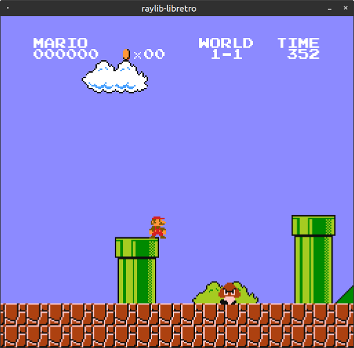

# raylib-libretro 

[libretro](https://www.libretro.com/) frontend using [raylib](https://www.raylib.com). *Still in early development.*



## Usage

```
raylib-libretro <core> [game]
```

For the controls, use the arrow keys, and ZXAS.

## Features

- [x] Video
- [ ] Graphical User Interface
- [ ] Smooth Audio
- [ ] Shaders

## Compile

``` sh
git clone http://github.com/robloach/raylib-libretro.git
cd raylib-libretro
git submodule update --init
mkdir build
cd build
cmake ..
make
```

## License

[zlib/libpng](LICENSE)
