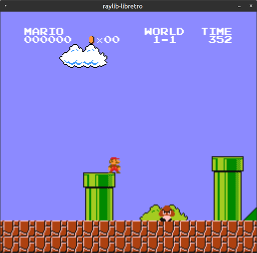

# raylib-libretro 

[libretro](https://www.libretro.com/) frontend using [raylib](https://www.raylib.com), along with the [`rlibretro.h`](include/rlibretro.h) raylib extension to integrate any raylib application with the libretro API. *Still in early development.*



## Usage

``` sh
raylib-libretro <core> [game]
```

### Controls

- D-Pad: Arrow Keys
- Gamepad Buttons: ZXAS
- Start: Enter
- Select: Right Shift

## Wishlist

- [x] Resizable Window
- [ ] Cleaned Audio
- [ ] Graphical User Interface
- [ ] Fullscreen
- [ ] Gamepad Support
- [ ] [`rlibretro.h`](include/rlibretro.h) documentation
- [ ] Project Templates (VS2017, etc)
- [ ] OpenGL Cores
- [ ] Mouse Support
- [ ] Zip Loading
- [ ] Core Options

## Compile

``` sh
git clone http://github.com/robloach/raylib-libretro.git
cd raylib-libretro
git submodule update --init
mkdir build
cd build
cmake ..
make
```

## License

[zlib/libpng](LICENSE)
