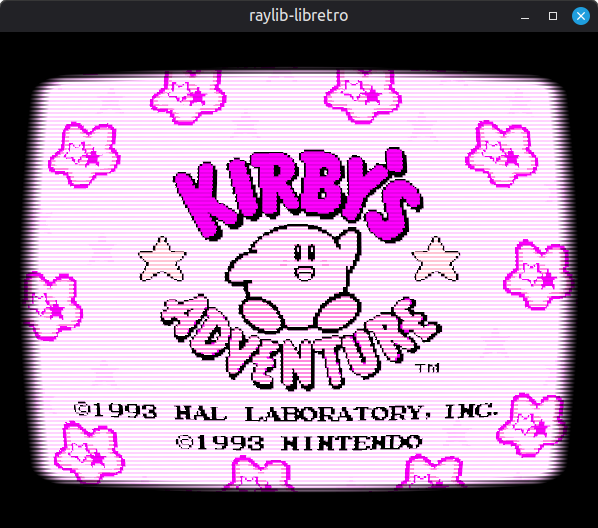

# raylib-libretro :space_invader: [](https://github.com/RobLoach/raylib-libretro/actions)

[libretro](https://www.libretro.com/) frontend to play emulators, game engines and media players, using [raylib](https://www.raylib.com). The [raylib-libretro.h](include/raylib-libretro.h) raylib extension allows integrating any raylib application with the libretro API. *Still in early development.*



## Usage

``` sh
raylib-libretro [core] [game]
```

| Control       | Keyboard    |
| ---           | ---         |
| D-Pad         | Arrow Keys  |
| Buttons       | ZX AS QW    |
| Start         | Enter       |
| Select        | Right Shift |
| Menu          | F1          |
| Save State    | F5          |
| Screenshot    | F8          |
| Load State    | F9          |
| Switch Shader | F10         |
| Fullscreen    | F11         |

### Core Support

The following cores have been tested with raylib-libretro:

- fceumm
- picodrive

## Wishlist

- [x] Video
- [x] Resizable Window
- [x] Graphical User Interface
- [x] Shaders
- [x] Mouse Support
- [x] Fullscreen
- [ ] Audio
- [ ] Core Options
- [ ] `raylib-libretro.h` documentation
- [ ] Rebindable Inputs
- [ ] Gamepad Support
- [ ] Project Templates (VS2017, etc)
- [ ] Zip Loading
- [ ] Binary Releases
- [ ] OpenGL Cores

## Compile

[CMake](https://cmake.org) is used to build raylib-libretro. Looking to add more project templates to help the build process!

``` sh
git clone --recursive http://github.com/robloach/raylib-libretro.git
cd raylib-libretro
mkdir build
cd build
cmake ..
make
```

### Mac OSX

- Make sure you have you have cmake/xcode-cli-tools installed
- Run the above compile instructions
- After installing RetroArch and some cores, you should be able to run the below:
    ```bash
    bin/raylib-libretro ~/Library/Application\ Support/RetroArch/cores/fceumm_libretro.dylib ~/Desktop/smb.nes
    ```

## License

[zlib/libpng](LICENSE)
