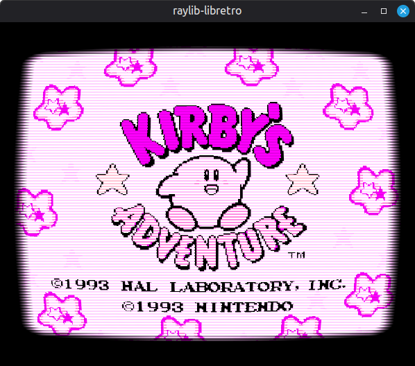

# raylib-libretro :space_invader: [](https://github.com/RobLoach/raylib-libretro/actions)

[libretro](https://www.libretro.com/) frontend to play emulators, game engines and media players, using [raylib](https://www.raylib.com). The [raylib-libretro.h](include/raylib-libretro.h) raylib extension allows integrating any raylib application with the libretro API. *Still in early development.*



## Usage

``` sh
raylib-libretro [core] [game]
```

## Controls

| Control            | Keyboard    |
| ---                | ---         |
| D-Pad              | Arrow Keys  |
| Buttons            | ZX AS QW    |
| Start              | Enter       |
| Select             | Right Shift |
| Rewind             | R           |
| Toggle Menu        | F1          |
| Save State         | F2          |
| Load State         | F4          |
| Screenshot         | F8          |
| Previous Shader    | F9          |
| Next Shader        | F10         |
| Fullscreen         | F11         |

## Core Support

The following cores have been tested with raylib-libretro:

- fceumm
- snes9x
- picodrive
- scummvm

## Compile

[CMake](https://cmake.org) is used to build raylib-libretro...

``` sh
git clone http://github.com/robloach/raylib-libretro.git
cd raylib-libretro
git submodule update --init
mkdir build
cd build
cmake ..
make
bin/raylib-libretro ~/.config/retroarch/cores/fceumm_libretro.so smb.nes
```

### Mac OSX

- Make sure you have you have `cmake/xcode-cli-tools` installed
- Run the above compile instructions
- After installing RetroArch and some cores, you should be able to run the below:
    ```bash
    bin/raylib-libretro ~/Library/Application\ Support/RetroArch/cores/fceumm_libretro.dylib ~/Desktop/smb.nes
    ```

## Basic Usage

```c
InitLibretro("fceumm.so");
LoadLibretroGame("mario.nes");
while (!WindowShouldClose()) {
    UpdateLibretro();
    BeginDrawing();
        ClearBackground(BLACK);
        DrawLibretro();
    EndDrawing();
}
CloseLibretro();
```

## API Reference

``` c
static bool InitLibretro(const char* core);
static bool LoadLibretroGame(const char* gameFile);
static bool IsLibretroReady();
static bool IsLibretroGameReady();
static void UpdateLibretro();
static bool LibretroShouldClose();
static void DrawLibretro();
static void DrawLibretroTint(Color tint);
static void DrawLibretroEx(Vector2 position, float rotation, float scale, Color tint);
static void DrawLibretroV(Vector2 position, Color tint);
static void DrawLibretroTexture(int posX, int posY, Color tint);
static void DrawLibretroPro(Rectangle destRec, Color tint);
static const char* GetLibretroName();
static const char* GetLibretroVersion();
static unsigned GetLibretroWidth();
static unsigned GetLibretroHeight();
static unsigned GetLibretroRotation();
static Texture2D GetLibretroTexture();
static bool DoesLibretroCoreNeedContent();
static void ResetLibretro();
static void UnloadLibretroGame();
static void CloseLibretro();
static void SetLibretroVolume(float volume);
static float GetLibretroVolume();
static bool SetLibretroCoreOption(const char* key, const char* value);
static const char* GetLibretroCoreOption(const char* key);
static void* GetLibretroSerializedData(unsigned int* size);
static bool SetLibretroSerializedData(void* data, unsigned int size);
static void ShowLibretroMessage(const char* msg, float duration);
static bool DrawLibretroMessage();
static const char* GetLibretroDirectory(int directory);
```

## Development

Update the dependencies through git submodules...
```sh
git submodule update --recursive --remote --init --force
```

Use clang-format to apply coding standards...
```c
clang-format -i *.h
```

## Contributors

- [Konsumer](https://github.com/konsumer)
- [MikeDX](https://github.com/MikeDX) and [libretro-raylib](https://github.com/MikeDX/libretro-raylib)

## License

[zlib/libpng](LICENSE)
