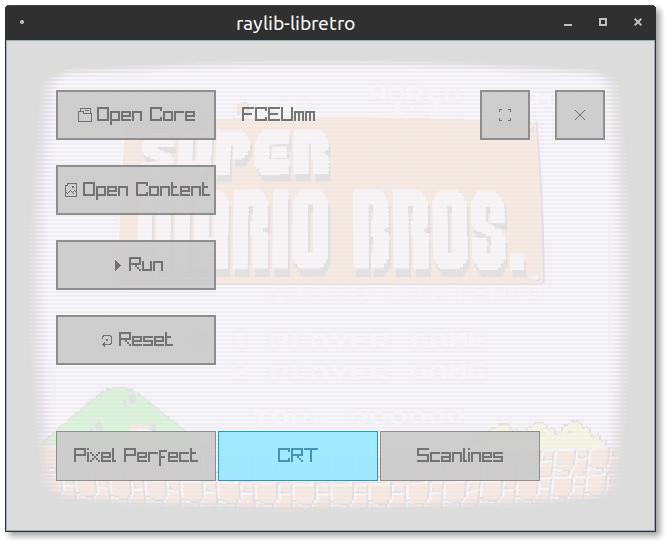

# raylib-libretro :space_invader: [](https://github.com/RobLoach/raylib-libretro/actions)

[libretro](https://www.libretro.com/) frontend to play emulators, game engines and media players, using [raylib](https://www.raylib.com). The [raylib-libretro.h](include/raylib-libretro.h) raylib extension allows integrating any raylib application with the libretro API. *Still in early development.*



## Usage

``` sh
raylib-libretro [core] [game]
```

| Control       | Keyboard    |
| ---           | ---         |
| D-Pad         | Arrow Keys  |
| Buttons       | ZX AS QW    |
| Start         | Enter       |
| Select        | Right Shift |
| Menu          | F1          |
| Switch Shader | F10         |
| Fullscreen    | F11         |

## Wishlist

- [x] Video
- [x] Resizable Window
- [x] Graphical User Interface
- [x] Shaders
- [x] Mouse Support
- [x] Fullscreen
- [ ] Audio
- [ ] Core Options
- [ ] `raylib-libretro.h` documentation
- [ ] Rebindable Inputs
- [ ] Gamepad Support
- [ ] Project Templates (VS2017, etc)
- [ ] Zip Loading
- [ ] Binary Releases
- [ ] OpenGL Cores

## Compile

[CMake](https://cmake.org) is used to build raylib-libretro. Looking to add more project templates to help the build process!

``` sh
git clone http://github.com/robloach/raylib-libretro.git
cd raylib-libretro
git submodule update --init
mkdir build
cd build
cmake ..
make
```

### Getting started on mac

- You should be able to build with instructions, above, if you have cmake/xcode-cli-tools installed.
- Install retroarch and install a few cores in it use menus to get to "install cores") fceumm works pretty well for NES

DnD didn't work for me, so I used CLI:

```bash
bin/raylib-libretro ~/Library/Application\ Support/RetroArch/cores/fceumm_libretro.dylib ~/Desktop/smb.nes
```

where `smb.nes` is your NES rom.


## License

[zlib/libpng](LICENSE)
